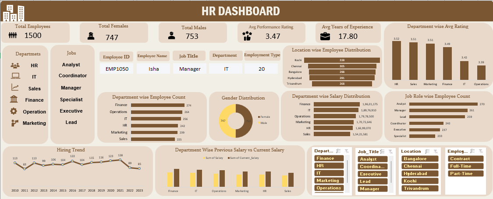

# 📊 HR Dashboard Insights and Analysis

## 📌 Project Overview
This project presents an **HR Dashboard** that provides a comprehensive view of workforce data, including demographics, performance, compensation, and hiring trends.  

The goal is to help HR teams make **data-driven decisions** through clear, interactive, and insightful visualizations.

---

## 📊 Dashboard Features

### 📈 Key Performance Indicators (KPIs)
- Total Employees  
- Gender Distribution  
- Average Performance Rating  
- Average Years of Experience  

### 🔍 Interactive Features
- Employee lookup using **XLOOKUP**  
- Data validation for dynamic selection  

### 🎛️ Filters & Slicers
- Department  
- Job Title  
- Location  
- Employment Type  

### 📌 Detailed Insights
- Department-wise analysis  
- Job role-wise distribution  
- Location-based workforce insights  

### 📉 Hiring Trend Analysis
- Identifies peak hiring periods  
- Highlights hiring slowdowns  

### 💰 Salary Analysis
- Comparison of previous vs current salary  
- Current salary = Base Salary + Bonus  

---

## 🎯 Purpose
This dashboard enables HR teams to:
- Improve recruitment strategies  
- Monitor employee performance  
- Optimize resource allocation  
- Gain actionable workforce insights  

---

## 🛠️ Tech Stack
- Microsoft Excel  
- XLOOKUP  
- Pivot Tables  
- Data Validation  
- Data Visualization  
- Pivot Charts  

---

## ▶️ How to Use
1. Open the **HR_DataAnalysis_Report**.  
2. Use **slicers and filters** to explore the data.  
3. Utilize the **employee lookup feature** for individual details.  
4. Analyze trends across departments, roles, and locations.  

---

## 🔍 Key Insights

### 📊 Workforce Overview
- **Total Employees:** 1500  
- **Total Females:** 747  
- **Total Males:** 753  
- **Average Performance Rating:** 3.47  
- **Average Years of Experience:** 17.80  

### 📈 Hiring Trends
- Peak hiring occurred in **2021 (128 employees)**  
- Hiring slowed after 2020, stabilizing at ~85 employees/year (2021–2023)  

### 💰 Salary Analysis
- Current Salary = Base Salary + Bonus  
- Department-wise comparison of Previous vs Current Salary using pivot charts  

### 📌 Additional Insights
- 📍 Most employees are based in **Kochi**, followed by **Chennai**  
- 🏦 **Finance department** has:  
  - Highest employee count  
  - Highest salary distribution  
- 🧑‍💼 **HR department** has the highest average performance rating  
- 📊 **Analyst** is the most common job role  

---

## 🗂 Project Files

-data: (https://docs.google.com/spreadsheets/d/1toDwpOW6qb-5ur4xTvKJn7eoU3ePrr7l/edit?usp=sharing&ouid=106616877993653454646&rtpof=true&sd=true)

-excel: (https://docs.google.com/spreadsheets/d/1TQq1hbBctg4E56airrDKGK4g99KzCmy0/edit?usp=sharing&ouid=106616877993653454646&rtpof=true&sd=true)  

-img: HR_Dashboard.png    

---
## 📸 Dashboard Preview

---

## 📌 Author
**Rose** – Data Analyst in progress, passionate about Excel, SQL, Power BI, and Python.  
Connect with me on [LinkedIn](https://www.linkedin.com/in/rose-ut-a94b1a27b).

---
